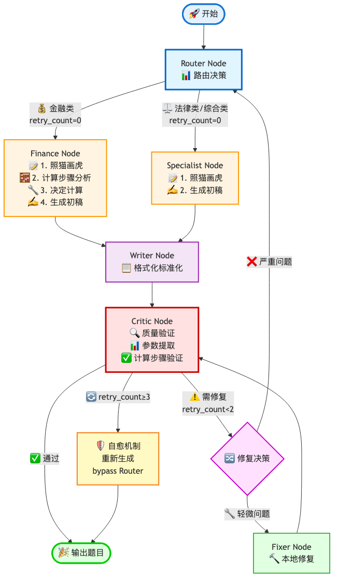

# 📝 搏学AI出题生成器

基于 **LangGraph 多智能体协同 + 自适应反馈循环** 的智能出题系统

## ✨ 功能特点

- 🤖 **多智能体协同**：Router、Finance、Specialist、Writer、Critic、Fixer 六大智能体分工协作
- 🔄 **自适应反馈循环**：自动质量检测、错误修复、智能重试机制
- 🧮 **智能计算验证**：Finance节点支持17种计算器工具，Critic节点自动验证计算准确性
- 📚 **知识库驱动**：基于MECE知识点体系，支持章节筛选和难度控制
- 🎯 **照猫画虎**：参考历史母题范例，确保题目质量稳定
- 🌐 **多模型支持**：支持 DeepSeek、OpenAI GPT、Ark（Doubao/GPT）等模型

## 🎬 系统架构



### 智能体工作流程

1. **Router Node（路由节点）** 📊
   - 分析知识点类型
   - 金融类 → Finance Node
   - 法律/综合类 → Specialist Node

2. **Finance Node（金融专家）** 💰
   - 支持17种计算工具（税费、贷款、面积等）
   - 自动识别计算需求并调用相应工具
   - 生成带详细计算步骤的初稿

3. **Specialist Node（专家节点）** ⚖️
   - 处理法律、政策、综合知识类题目
   - 参考历史母题进行生成

4. **Writer Node（写作节点）** ✍️
   - 格式化标准化
   - 统一题目输出格式

5. **Critic Node（评审节点）** 🕵️
   - 质量验证（参数提取、计算验证）
   - 自动调用计算器验证答案准确性
   - 决策：通过/需要修复/重新生成

6. **Fixer Node（修复节点）** 🔧
   - 针对性修复轻微问题
   - 避免完整重新生成

### 容错机制

- ✅ **轻微问题** → Fixer本地修复
- ❌ **严重问题** → 返回Router重新路由
- 🔄 **重试≥3次** → 自愈机制（bypass Router直接重新生成）

## 🚀 快速开始

内网同事执行请优先查看：`部署说明.md`（已按“可直接执行”整理为上线 Runbook）。

### 1. 环境要求

- Python 3.8+
- Node.js 20.x（推荐配合 `nvm use`，项目根目录已提供 `.nvmrc`）
- 依赖包见 `requirements.txt`

### 2. 安装依赖

```bash
# 一键初始化（推荐用于服务器，含 Node 版本检查 + npm ci + vite 完整性校验）
bash tools/bootstrap_server.sh
```

手动安装方式（不推荐）：

```bash
python3 -m venv .venv
.venv/bin/pip install -r requirements.txt
npm --prefix admin-web ci
```

### 3. 配置 API Key

部署前必须存在 `填写您的Key.txt`（缺失将导致启动脚本直接失败）。  
可从 `填写您的Key.txt.example` 复制后编辑：

```
# 推荐：AIT 配置（当前主流程）
AIT_API_KEY=你的密钥
AIT_BASE_URL=https://openapi-ait.ke.com
AIT_MODEL=deepseek-chat

# 兼容：OPENAI_* 仍可用
# OPENAI_API_KEY=你的密钥
# OPENAI_BASE_URL=https://openapi-ait.ke.com
# OPENAI_MODEL=deepseek-chat
```

### 4. 运行应用（后端 + 管理台）

```bash
# 终端1：启动后端 API
.venv/bin/python admin_api.py

# 终端2：启动前端管理台
npm --prefix admin-web run dev -- --host 127.0.0.1 --port 8522
```

默认访问地址：
- 后端健康检查：`http://127.0.0.1:8600/`
- 前端管理台：`http://127.0.0.1:8522/`

## 📖 使用说明

1. **选择章节**：在界面中选择出题范围（支持多选）
2. **配置参数**：设置题目数量、难度、题型
3. **选择模式**：
   - **灵活模式**：场景化、灵活表达，适合日常练习
   - **严谨模式**：严格按照知识点，适合标准化考试
4. **开始出题**：点击按钮，实时查看智能体协同过程
5. **下载结果**：导出为Excel文件

## 🧪 测试说明

- 自动化测试（CI/pytest）仅运行 `test_*.py`
- 脚本化/手工 UI 测试已迁移到 `manual_tests/`，需要手动执行，不参与 CI

## 📁 项目结构

```
├── admin_api.py                    # Flask 管理后台 API
├── admin-web/                      # React + Vite 管理台
├── exam_factory.py                 # 知识库检索和数据模型
├── exam_graph.py                   # LangGraph 智能体定义
├── calculation_logic.py            # 17种计算器工具
├── bot_knowledge_base.jsonl        # 知识库数据
├── docs/                           # 文档和流程图
│   ├── 系统流程图.png
│   ├── 技术文档.md
│   └── 架构文档.md
└── requirements.txt                # Python依赖
```

## 🛠 技术栈

- **LangGraph**：智能体编排框架
- **Streamlit**：Web界面
- **LangChain**：大模型调用封装
- **Pandas**：数据处理
- **Pydantic**：数据验证

## 🔧 支持的计算工具

Finance Node 和 Critic Node 共享17种计算器：

| 计算器 | 功能 |
|--------|------|
| `calc_deed_tax` | 契税计算 |
| `calc_vat` | 增值税计算 |
| `calc_income_tax` | 个人所得税 |
| `calc_loan_payment` | 贷款月供 |
| `calc_provident_fund_loan` | 公积金贷款 |
| `calc_building_area` | 建筑面积 |
| `calc_floor_area_ratio` | 容积率 |
| ... | 共17种工具 |

## 📊 知识库说明

项目包含完整的房地产经纪考试知识库：

- **bot_knowledge_base.jsonl**：MECE结构化知识点
- **存量房买卖母卷ABCD.xls**：历史母题范例（照猫画虎用）

## 🤝 贡献

欢迎提交Issue和Pull Request！

## 📄 许可证

MIT License

## 👨‍💻 作者

搏学考试团队

---

⭐ 如果这个项目对您有帮助，请给我们一个星标！
