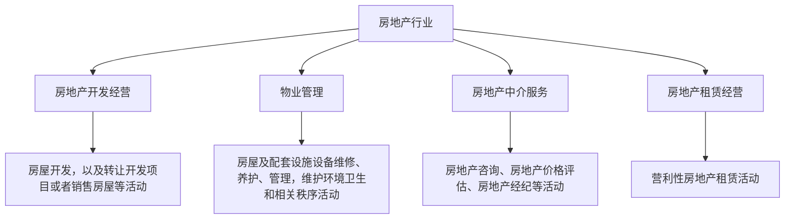
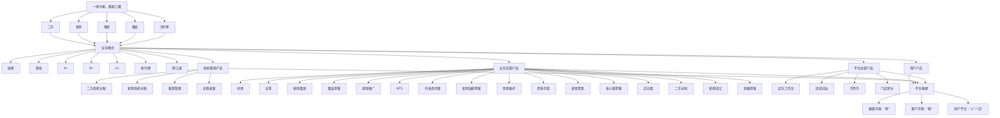
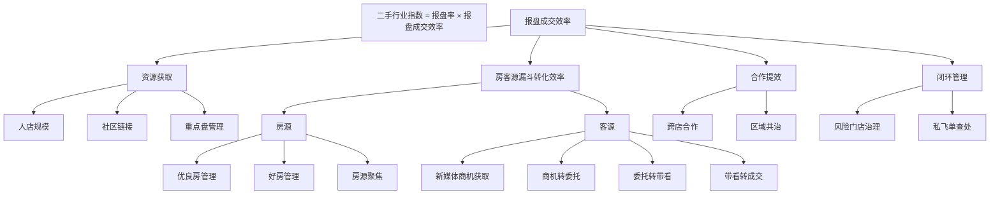
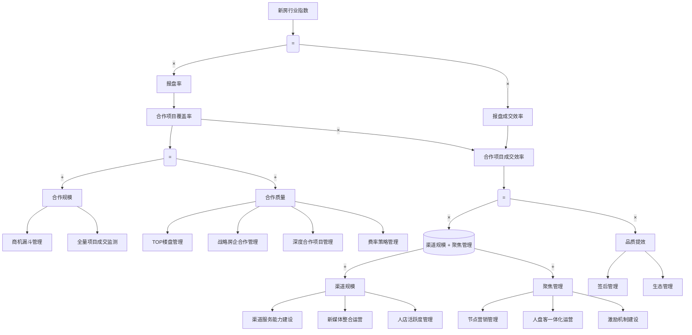

# 存量房教材第一篇 Mermaid 导出

- 教材版本: `v20260224_131517`
- 命中切片: `4`
- Mermaid 块总数: `5`

## slice_id=0
- 路径: 第一篇  行业与贝壳 > 第一章  认识行业 > 第一节  房地产行业 > 一、房地产行业的构成
- 掌握程度: 了解

### mermaid_1
- image_id: `image5.png`
- image_path: `data/wh/slices/images/v20260224_131517/image5.png`

## slice_id=6
- 路径: 第一篇  行业与贝壳 > 第二章  认识贝壳 > 第一节  贝壳发展历程 > 一、从链家到贝壳
- 掌握程度: 了解

### mermaid_1
- image_id: `image6.jpeg`
- image_path: `data/wh/slices/images/v20260224_131517/image6.jpeg`

```mermaid
flowchart LR
    标题[居住产业互联网演进路径-先竖再横] --> 节点1[2001-2004<br>建立行业新标准<br>链家推出签三方约、<br>透明交易、不吃差价]
    节点1 --> 节点2[2008<br>建立楼盘字典<br>开始楼盘字典建设的探<br>索，推动房源信息数据<br>化]
    节点2 --> 节点3[2009-2011<br>开启互联网化<br>链家在线（HomeLink）<br>上线，开始链家数据、<br>技术驱动的互联网尝试]
    节点3 --> 节点4[2011-2014<br>安心服务升级<br>率先制定真房源标准、<br>推出五重保障、四大安<br>心服务承诺<br>链家在线正式更名为链<br>家网]
    节点4 --> 节点5[2015-2017<br>成为行业领导者<br>开启全国化布局，成为居<br>住领域领先品牌<br>郑州试点加盟模式]
    节点5 --> 节点6[2018<br>面向行业开放提供服务<br>链家网升级为贝壳找房，<br>打造科技驱动的新居住服<br>务商<br>推出创新服务VR看房]
    节点6 --> 节点7[2019<br>推动行业正循环<br>从连接到联结，全面提高行业<br>人店效率，撬动服务者价值，<br>推动店东职业化]
    节点7 --> 节点8[2020<br>开启全面数字化<br>完成交易线上化闭环<br>数字化能力升级]
    节点8 --> 节点9[2020.8.13<br>贝壳上市<br>成为“中国居住服务<br>第一股”]
    节点9 --> 节点10[2021<br>新居住价值共建<br>多赛道协同，继续推进品<br>质服务<br>助力更多新居住服务者<br>角色专业化、职业化<br>推动社区连接，积极践行<br>企业社会责任]
    节点10 --> 节点11[2022<br>一体两翼战略升级<br>成立“整装家居”和“惠居”事业群<br>品牌升级：让家更美好<br>回港上市]
    节点11 --> 节点12[2023<br>战略升级“一体三翼”<br>新设“贝好家”事业线<br>提出“翻越第二座山”<br>定位“科技驱动的一站<br>式新居住服务平台”]
```

## slice_id=19
- 路径: 第一篇  行业与贝壳 > 第二章  认识贝壳 > 第三节  贝壳特色 > 二、基础支持体系 > （三）贝壳产品
- 掌握程度: 了解

### mermaid_1
- image_id: `image7.png`
- image_path: `data/wh/slices/images/v20260224_131517/image7.png`

## slice_id=31
- 路径: 第一篇  行业与贝壳 > 第二章  认识贝壳 > 第三节  贝壳特色 > 六、守文化，促增长 > （二）促增长
- 掌握程度: 了解

### mermaid_1
- image_id: `image9.png`
- image_path: `data/wh/slices/images/v20260224_131517/image9.png`

### mermaid_2
- image_id: `image10.png`
- image_path: `data/wh/slices/images/v20260224_131517/image10.png`

