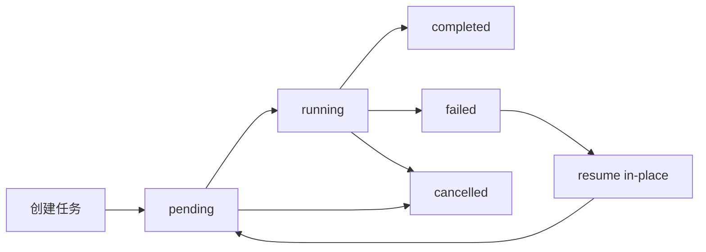

# 出题任务状态机与续跑规则

本文档说明管理后台“AI出题”任务的生命周期、状态变化、取消机制，以及普通任务和模板任务的续跑规则。

## 1. 任务对象

每个出题任务都会生成一个 `task_id`，并保存以下核心信息：

- `task_name`
- `tenant_id`
- `status`
- `request`
- `run_id`
- `generated_count`
- `saved_count`
- `error_count`
- `progress`
- `process_trace`

代码参考：

- [admin_api.py](/Users/panting/Desktop/搏学考试/AI出题/admin_api.py#L6562)

## 2. 任务状态

当前主状态包括：

- `pending`
- `running`
- `completed`
- `failed`
- `cancelled`

说明：

- `pending / running / completed / failed` 是 `_make_gen_task` 及任务执行主流程里的核心状态
- `cancelled` 在取消接口和执行中断分支里也会出现

代码参考：

- [admin_api.py](/Users/panting/Desktop/搏学考试/AI出题/admin_api.py#L6574)
- [admin_api.py](/Users/panting/Desktop/搏学考试/AI出题/admin_api.py#L17071)

## 3. 状态机

## 4. 正常任务流转

### 4.1 创建

接口：

- `POST /api/{tenant}/generate/tasks`

创建时会：

- 校验任务名是否重复
- 校验模板是否存在
- 落一条 `pending` 任务快照
- 异步启动工作线程

代码参考：

- [admin_api.py](/Users/panting/Desktop/搏学考试/AI出题/admin_api.py#L16522)

### 4.2 运行

工作线程启动后，状态会切换为 `running`。

运行中会不断更新：

- `progress`
- `current_node`
- `process_trace`
- `generated_count`
- `saved_count`
- `subtasks`

代码参考：

- [admin_api.py](/Users/panting/Desktop/搏学考试/AI出题/admin_api.py#L14954)

### 4.3 完成

达到目标题量且任务收尾成功后，状态进入 `completed`。

完成并不等于“每题都完美”，但至少代表：

- 任务流程正常结束
- 最终完成事件已落盘
- 任务详情页可查看最终 run

### 4.4 失败

以下情况通常会进入 `failed`：

- 主执行线程异常
- 模板规划失败
- 任务异常结束且未收到完成事件
- 任务已失去活跃执行者，被判定为孤儿运行并强制失败

代码参考：

- [admin_api.py](/Users/panting/Desktop/搏学考试/AI出题/admin_api.py#L16500)
- [admin_api.py](/Users/panting/Desktop/搏学考试/AI出题/admin_api.py#L16610)

## 5. 取消机制

接口：

- `POST /api/{tenant}/generate/tasks/{task_id}/cancel`

取消规则：

- `pending` 任务可直接取消
- `running` 任务不会立即硬停，而是打 `cancel_requested`
- 运行中的题目会尽快在安全点结束

返回状态通常为：

- `cancel_requested`
- 或已结束任务的原状态

代码参考：

- [admin_api.py](/Users/panting/Desktop/搏学考试/AI出题/admin_api.py#L17071)

## 6. 普通任务续跑

接口：

- `POST /api/{tenant}/generate/tasks/{task_id}/resume`

普通任务续跑逻辑：

1. 读取原任务快照
2. 计算原任务目标题量 `total`
3. 用 `max(generated_count, saved_count)` 作为已完成数量
4. 生成剩余题量 `remain`
5. 以原 `task_id` 原地续跑

续跑后：

- 仍复用同一个 `task_id`
- `status` 回到 `pending`
- 再进入 `running`
- `started_at` 可沿用原值，便于展示总耗时

如果没有剩余题量，会返回：

- `NO_REMAINING_WORK`

代码参考：

- [admin_api.py](/Users/panting/Desktop/搏学考试/AI出题/admin_api.py#L6939)
- [admin_api.py](/Users/panting/Desktop/搏学考试/AI出题/admin_api.py#L6998)
- [admin_api.py](/Users/panting/Desktop/搏学考试/AI出题/admin_api.py#L16651)

## 7. 模板任务续跑

模板任务的续跑比普通任务复杂。

原因：

- 模板任务不是简单“补 N 题”
- 它有模板槽位、路由前缀、掌握度、切片分配等约束

因此模板续跑的核心原则是：

- 不按“剩余题量”粗暴补题
- 而是按“模板缺口”重建剩余位次

代码中表现为：

- 若是模板任务，会重建 `resume_body`
- 再调用 `_rebuild_template_resume_gap_plan(...)`
- 若缺口已补齐，则直接返回“无需续跑”

代码参考：

- [admin_api.py](/Users/panting/Desktop/搏学考试/AI出题/admin_api.py#L16708)
- [admin_api.py](/Users/panting/Desktop/搏学考试/AI出题/admin_api.py#L16774)

## 8. 批量续跑未完成任务

接口：

- `POST /api/{tenant}/generate/tasks/resume-incomplete`

用途：

- 批量扫描某城市内历史未完成任务
- 默认更偏向模板任务
- 自动跳过仍在运行中的任务

返回内容包括：

- `created_count`
- `skipped_count`
- `created`
- `skipped`

适用场景：

- 服务重启后补跑
- 模板批量任务中有历史缺口待修复

代码参考：

- [admin_api.py](/Users/panting/Desktop/搏学考试/AI出题/admin_api.py#L16734)

## 9. 孤儿任务判定

如果任务快照显示还是 `pending/running`，但实际上：

- 不在当前进程内存中
- 对应 run 也不再活跃
- 持续超过孤儿任务阈值

系统会将其判定为“孤儿任务”，并强制改成 `failed`，然后才允许续跑。

这样做的目的：

- 避免一个已经死掉的旧任务永久阻塞 resume

代码参考：

- [admin_api.py](/Users/panting/Desktop/搏学考试/AI出题/admin_api.py#L16664)

## 10. 模板任务与子任务

模板任务在执行中可能拆分为内部子任务。

这些子任务：

- 有独立 `task_id`
- 会记录到父任务 `subtasks`
- 主要用于并发执行与修复子批次
- 前端列表页默认不会把它们当成顶层任务显示

因此：

- 父任务是业务主入口
- 子任务是运行时实现细节

代码参考：

- [admin_api.py](/Users/panting/Desktop/搏学考试/AI出题/admin_api.py#L7009)
- [admin_api.py](/Users/panting/Desktop/搏学考试/AI出题/admin_api.py#L16926)

## 11. 进度口径

常见进度相关字段：

- `generated_count`
  - 已生成题目数

- `saved_count`
  - 已入库题目数

- `error_count`
  - 错误数量

- `progress.current`
  - 当前进度值

- `progress.total`
  - 目标题量

注意：

- 续跑时，`progress.total` 可能沿用原总题量
- 模板任务和普通任务在进度口径上不完全相同

## 12. 什么时候不建议直接续跑

以下场景不建议直接 resume：

- 原教材版本已重切片
- 原模板规则已发生大幅变化
- 原任务失败原因是 Key、权限或教材生效条件缺失

这类情况更适合：

- 先修环境
- 或新建任务重新生成

## 13. 推荐排障顺序

任务失败后建议按以下顺序看：

1. 看任务详情页的 `errors`
2. 看 `process_trace`
3. 看是否存在 `cancel_requested`
4. 看是否是模板缺口规划失败
5. 看后端日志

如果是历史挂起任务，再考虑是否执行续跑。
