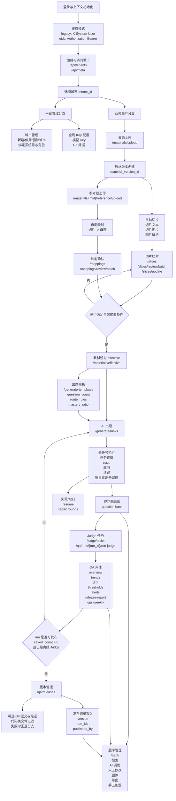
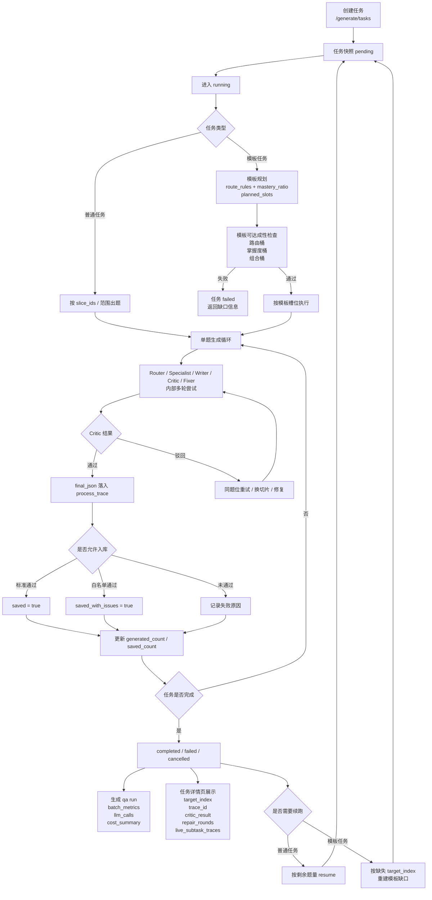

# 当前系统全链路流程图（2026-04-09）

本文档基于当前代码中的管理后台页面、核心 API、长任务链路和 QA/发布能力整理。

## 1. 平台全链路图

## 2. 单次出题任务内部循环

## 3. 阅读建议

- 先看“平台全链路图”，理解教材、审核、出题、Judge、QA、发布、题库之间的闭环关系。
- 再看“单次出题任务内部循环”，理解为什么任务详情页里会出现多条 trace、repair round 和 resume。
