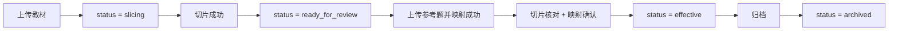

# 教材版本状态机

本文档说明教材版本从上传到生效的完整状态流转，以及重切片、重映射、归档、删除等行为对状态的影响。

## 1. 关键对象

每次上传教材后，系统会生成一个独立的 `material_version_id`。

教材版本会关联以下信息：

- 原始文件路径
- 切片文件
- 参考题文件
- 映射文件
- 切片审核记录
- 映射审核记录
- 当前业务状态

代码参考：

- [slice_registry.py](/Users/panting/Desktop/搏学考试/AI出题/slice_registry.py)
- [admin_api.py](/Users/panting/Desktop/搏学考试/AI出题/admin_api.py#L11711)

## 2. 双层状态

教材版本不是单一状态，而是两层：

- 主状态 `status`
  - `slicing`
  - `ready_for_review`
  - `effective`
  - `archived`

- 子状态
  - `slice_status`
    - 常见值：`pending / running / success / failed`
  - `mapping_status`
    - 常见值：`pending / running / success / failed`

前端展示时会同时参考这几组字段。

## 3. 主流程状态图

## 4. 各状态含义

### 4.1 `slicing`

含义：

- 教材刚上传
- 系统正在执行 `generate_knowledge_slices.py`
- 此时还不能用于出题

常见伴随字段：

- `slice_status=running`
- `mapping_status=pending`

代码参考：

- [admin_api.py](/Users/panting/Desktop/搏学考试/AI出题/admin_api.py#L12399)

### 4.2 `ready_for_review`

含义：

- 切片已成功生成
- 版本已经可以进入人工审核流程
- 但还不是生效教材

这通常是教材上传成功后的初始稳定状态。

常见伴随字段：

- `slice_status=success`
- `mapping_status=pending` 或 `success`

代码参考：

- [admin_api.py](/Users/panting/Desktop/搏学考试/AI出题/admin_api.py#L12454)

### 4.3 `effective`

含义：

- 当前城市的正式生效教材
- 出题默认会优先使用该版本

注意：

- 生效前不仅要切片成功、映射成功
- 还要求至少存在 1 条切片同时完成切片核对和映射确认

代码参考：

- [admin_api.py](/Users/panting/Desktop/搏学考试/AI出题/admin_api.py#L12259)
- [slice_registry.py](/Users/panting/Desktop/搏学考试/AI出题/slice_registry.py#L61)

### 4.4 `archived`

含义：

- 该版本已下线
- 数据仍保留，但不再作为当前生效教材

适用场景：

- 新教材版本已替代旧版本
- 需要保留历史记录但停止继续使用

代码参考：

- [admin_api.py](/Users/panting/Desktop/搏学考试/AI出题/admin_api.py#L12299)
- [slice_registry.py](/Users/panting/Desktop/搏学考试/AI出题/slice_registry.py#L86)

## 5. 上传教材后的流转

上传教材接口：

- `POST /api/{tenant}/materials/upload`

处理逻辑：

1. 生成新的 `material_version_id`
2. 记录主状态为 `slicing`
3. 执行切片脚本
4. 如果切片成功且切片数大于 0，则进入 `ready_for_review`
5. 如果切片失败，则保留失败信息

失败分支：

- 切片脚本异常：`slice_status=failed`
- 切片结果为空：`slice_status=failed`

代码参考：

- [admin_api.py](/Users/panting/Desktop/搏学考试/AI出题/admin_api.py#L12272)

## 6. 上传参考题与映射后的流转

上传参考题接口：

- `POST /api/{tenant}/materials/{material_version_id}/reference/upload`

处理逻辑：

- 上传参考题文件
- 异步启动映射任务
- 将 `mapping_status` 置为 `running`
- 映射完成后进入 `success`，失败则进入 `failed`

映射任务状态可通过：

- `GET /api/{tenant}/materials/{material_version_id}/mapping-job`

代码参考：

- [admin_api.py](/Users/panting/Desktop/搏学考试/AI出题/admin_api.py#L11794)
- [admin_api.py](/Users/panting/Desktop/搏学考试/AI出题/admin_api.py#L12119)

## 7. 重切片的状态影响

接口：

- `POST /api/{tenant}/materials/{material_version_id}/reslice`

重切片会做两件关键事：

- 重新生成切片文件
- 清空旧的切片审核、切片生成健康、映射文件和映射审核数据

原因：

- 只要切片内容变了，旧审核和旧映射都不再可靠

重切片后的状态：

- `status` 通常回到 `ready_for_review`
- `slice_status=success`
- `mapping_status=pending`
- `mapping_error=切片已更新，请重新映射`

若该版本之前就是 `effective` 或 `archived`，主状态会尽量保留原值，但映射仍需重做。

代码参考：

- [admin_api.py](/Users/panting/Desktop/搏学考试/AI出题/admin_api.py#L11898)

## 8. 重映射的状态影响

接口：

- `POST /api/{tenant}/materials/{material_version_id}/remap`

处理逻辑：

- 不改切片
- 重新生成映射文件
- 将 `mapping_status` 置为 `running`

代码参考：

- [admin_api.py](/Users/panting/Desktop/搏学考试/AI出题/admin_api.py#L12032)

## 9. 生效判定

一个教材版本可设为生效，必须同时满足：

- `slice_status=success`
- `mapping_status=success`
- 切片文件存在
- 映射文件存在
- 至少 1 条切片同时完成切片核对和映射确认

前端列表里会额外返回：

- `can_set_effective`
- `dual_review_slice_count`
- `effective_block_reason`

代码参考：

- [admin_api.py](/Users/panting/Desktop/搏学考试/AI出题/admin_api.py#L11871)
- [admin_api.py](/Users/panting/Desktop/搏学考试/AI出题/admin_api.py#L12259)

## 10. 归档与删除

### 10.1 归档

接口：

- `POST /api/{tenant}/materials/{material_version_id}/archive`

行为：

- 仅把主状态改成 `archived`
- 保留教材、切片、映射、审核记录

### 10.2 删除

接口：

- `DELETE /api/{tenant}/materials/{material_version_id}`

行为：

- 清理该教材版本关联的运行产物
- 从注册表中删除

限制：

- 若当前版本仍是 `effective`，默认不能删
- 需要显式 `force=1` 才能强删

代码参考：

- [admin_api.py](/Users/panting/Desktop/搏学考试/AI出题/admin_api.py#L12299)
- [admin_api.py](/Users/panting/Desktop/搏学考试/AI出题/admin_api.py#L12330)

## 11. 常见异常

- `slice_status=success`，但 `status` 仍是 `slicing`
  - 后端会在列表接口里做一次自愈，自动视为 `ready_for_review`

- `mapping_status=success`，但映射文件实际丢失
  - 后端会在列表接口里回退成 `pending`，并提示“映射文件缺失，请重新映射”

代码参考：

- [admin_api.py](/Users/panting/Desktop/搏学考试/AI出题/admin_api.py#L11821)

## 12. 建议业务操作顺序

推荐顺序：

1. 上传教材
2. 等切片成功
3. 上传参考题并生成映射
4. 切片核对
5. 映射确认
6. 设为生效教材
7. 再进入 AI 出题

不建议：

- 教材刚切片成功就直接尝试生效
- 重切片后沿用旧映射和旧审核结果
