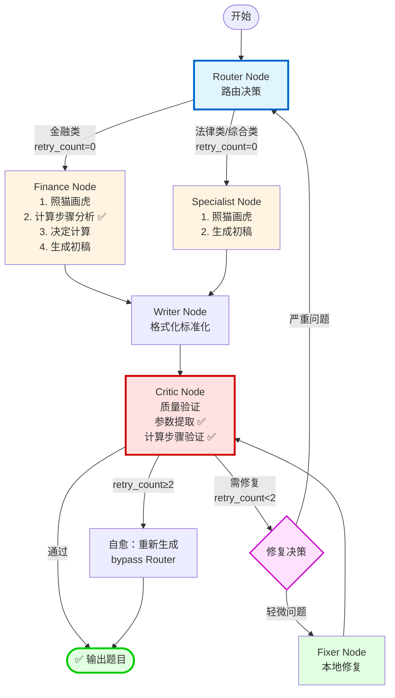

# 智能出题系统 - 执行流程图

## 系统流程图（最新版 ✅）



**说明**：该流程图反映了当前已实现的完整反馈循环机制。

## 详细流程说明

### 阶段1: 路由与生成
```
用户输入 (kb_chunk + question_type + generation_mode) ✅
    ↓
Router Node
    ├─ 分析知识点内容
    ├─ 计算金融/法律相关度
    ├─ 提取掌握程度
    └─ 决定: FinanceAgent / LegalAgent / GeneralAgent
    ↓
Specialist/Finance Node
    ├─ 照猫画虎 (获取 examples)
    ├─ [Finance only] 计算步骤分析 ✅
    │   ├─ 理解计算器可能只是解决一个步骤
    │   ├─ 分析是否需要多步计算
    │   └─ 提取具体数值参数（不能是描述性文字）✅
    ├─ [Finance only] 决定是否调用计算器
    └─ 生成初稿 (draft)
      └─ 根据 generation_mode 调整提示词（灵活/严谨）✅
    ↓
Writer Node
    └─ 格式化为标准 JSON (final_json)
```

### 阶段2: 质量验证
```
Critic Node
    ├─ [Finance] 参数提取 ✅
    │   ├─ 从题目中提取具体数值（不能是描述性文字）
    │   └─ 如果无法提取，不调用计算器
    ├─ [Finance] 计算步骤验证 ✅
    │   ├─ 理解计算器可能只是解决一个步骤
    │   ├─ 如果计算器结果是中间步骤，验证完整计算过程
    │   └─ 验证是否考虑了所有相关因素
    ├─ 验证答案正确性
    ├─ 验证解析逻辑性
    │   └─ 如果涉及多步计算，检查是否说明了所有步骤 ✅
    └─ 决策:
        ├─ 通过 → END
        └─ 需修复 → 判断 retry_count
```

### 阶段3: 错误处理（✅ 已实现完整循环）
```
✅ 已实现方案:
Critic 发现问题
    ↓
critical_decision() 智能决策
    ├─ 问题类型判断:
    │   ├─ 轻微问题 (解析不清、格式问题)
    │   │   → Fixer Node → 修复 → 回到 Critic ✅ 形成循环
    │   │
    │   └─ 严重问题 (答案错误)
    │       → 回到 Router ✅ 重新路由
    │           → 可能选择不同的 Agent
    │           → 重新执行整个流程
    │
    └─ retry_count ≥ 3 → 自愈输出 → END
```

## ✅ 当前代码实现（已完成）

### exam_graph.py 中的 Graph 构建

```python
# ✅ 已实现的边连接 (exam_graph.py 第789-817行)
workflow.add_edge("specialist", "writer")
workflow.add_edge("finance", "writer")
workflow.add_edge("writer", "critic")

# Critic 的智能决策
workflow.add_conditional_edges(
    "critic",
    critical_decision,  # ✅ 已实现
    {
        "pass": END,           # 通过 → 结束
        "fix": "fixer",        # 轻微问题 → Fixer
        "reroute": "router",   # ✅ 严重问题 → 回到 Router 重新路由
        "self_heal": END       # retry ≥ 3 → 自愈输出
    }
)

# Fixer 修复后回到 Critic 验证
workflow.add_edge("fixer", "critic")  # ✅ Fixer → Critic 循环

# Router 的条件边
workflow.add_conditional_edges(
    "router",
    route_agent,  # 根据 agent_name 路由
    {
        "finance": "finance",
        "specialist": "specialist"
    }
)
```

## LangGraph Loop 功能详解

### 什么是 Loop？
LangGraph 的 loop 功能允许节点之间形成循环，常见模式：

1. **Self-Loop** (自循环)
   ```python
   workflow.add_edge("node_a", "node_a")  # 节点可以回到自己
   ```

2. **Feedback Loop** (反馈循环)
   ```python
   workflow.add_edge("node_a", "node_b")
   workflow.add_edge("node_b", "node_a")  # A ↔ B 循环
   ```

3. **Multi-Node Loop** (多节点循环)
   ```python
   # A → B → C → A
   workflow.add_edge("node_a", "node_b")
   workflow.add_edge("node_b", "node_c")
   workflow.add_edge("node_c", "node_a")
   ```

### 我们需要的 Loop 模式

```
Router → Specialist/Finance → Writer → Critic
   ↑                                      ↓
   └──────────── reroute ────────────────┘
                                         ↓
                                      Fixer
                                         ↓
                                      Critic (验证修复结果)
```

## ✅ 核心功能实现详解

### critical_decision() - 智能决策函数

```python
# ✅ 已实现 (exam_graph.py 第580-607行)
def critical_decision(state: AgentState):
    """
    智能决策函数：根据 Critic 结果决定下一步
    - pass: 审核通过 → END
    - fix: 轻微问题 → Fixer 修复
    - reroute: 严重问题 → Router 重新路由
    - self_heal: 超限 → 自愈输出
    """
    critic_result = state.get('critic_result', {})
    retry_count = state.get('retry_count', 0)
    
    # 通过
    if critic_result.get('passed'):
        return "pass"
    
    # 超限自愈 (≥3次)
    if retry_count >= 3:
        return "self_heal"
    
    # 判断问题严重程度
    issue_type = critic_result.get('issue_type', 'minor')
    
    if issue_type == 'major':
        # 严重问题（答案错误）→ 回到 Router 重新路由
        return "reroute"
    else:
        # 轻微问题（解析不清等）→ Fixer 修复
        return "fix"
```

### Critic Node - 问题分类逻辑

```python
# ✅ 已实现 (exam_graph.py 第463-484行)
def critic_node(state, config):
    # ... 验证逻辑 ...
    
    if critic_answer == gen_answer and explanation_valid:
        return {
            "critic_result": {"passed": True},
            # ...
        }
    else:
        fail_reason = ""
        issue_type = "minor"  # 默认轻微问题
        
        if critic_answer != gen_answer:
            fail_reason += f"答案不一致 (批评家: {critic_answer} vs 生成者: {gen_answer}); "
            issue_type = "major"  # ✅ 答案错误是严重问题
        if not explanation_valid:
            fail_reason += f"解析不合格 ({reason}); "
            # 解析问题通常可以修复，保持 minor
            
        return {
            "critic_result": {
                "passed": False,
                "issue_type": issue_type,  # ✅ 区分问题严重程度
                "reason": fail_reason
            },
            "retry_count": state['retry_count'] + 1,
            # ...
        }
```

### Router Node - 重路由状态清理

```python
# ✅ 已实现 (exam_graph.py 第189-210行)
def router_node(state: AgentState, config):
    # ... 路由逻辑 ...
    
    # 如果是重新路由（retry_count > 0），清理旧的生成结果
    if state.get('retry_count', 0) > 0:
        state_updates["draft"] = None
        state_updates["final_json"] = None
        state_updates["logs"].append(f"🔄 检测到重新路由 (retry #{state['retry_count']})，已清理旧状态")
    
    return state_updates
```

## 总结

### ✅ 已实现的核心功能
1. ✅ **Fixer → Critic 循环**: 修复后自动回到 Critic 重新验证
2. ✅ **Critic → Router 重新路由**: 答案错误等严重问题触发重新路由
3. ✅ **智能问题分类**: 区分 major（答案错误）和 minor（解析问题）
4. ✅ **自愈机制**: retry_count ≥ 3 时自动输出，避免无限循环
5. ✅ **状态清理**: Router 检测重路由并清理旧状态
6. ✅ **出题模式**: 支持灵活/严谨两种模式，适应不同场景
7. ✅ **计算步骤分析**: Finance Node 和 Critic Node 都能理解多步计算
8. ✅ **参数提取规则**: 必须提取具体数值，不能使用描述性文字
9. ✅ **干扰项设计**: 利用"相近的数字"和"错误的参照物"设计干扰项

### 系统优势
1. 🎯 **质量保障**: 多层验证确保题目准确性
2. 🔄 **自适应修复**: 根据问题严重程度选择修复策略
3. 🛡️ **容错能力**: 完善的错误处理和重试机制
4. 📊 **可观测性**: 完整的日志记录每个决策节点
5. 🧮 **智能计算**: 理解计算步骤，支持多步计算验证
6. 🎨 **灵活出题**: 支持灵活/严谨两种模式，适应不同场景
7. 🎯 **精准参数**: 严格的参数提取规则，确保计算准确性
5. 🧮 **智能计算**: 理解计算步骤，支持多步计算验证 ✅
6. 🎨 **灵活出题**: 支持灵活/严谨两种模式，适应不同场景 ✅
7. 🎯 **精准参数**: 严格的参数提取规则，确保计算准确性 ✅
