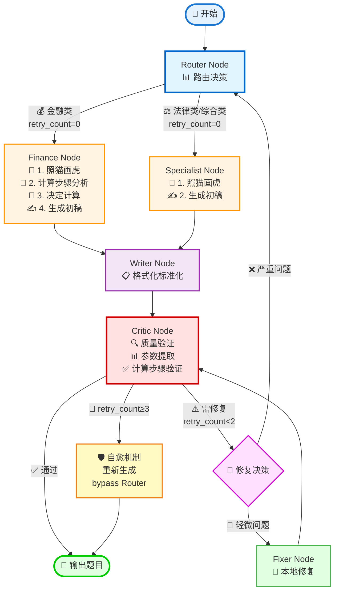
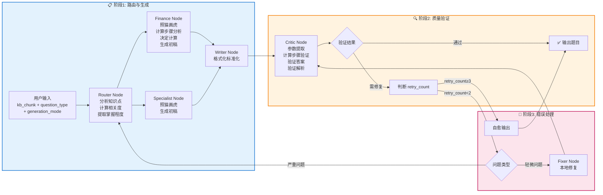
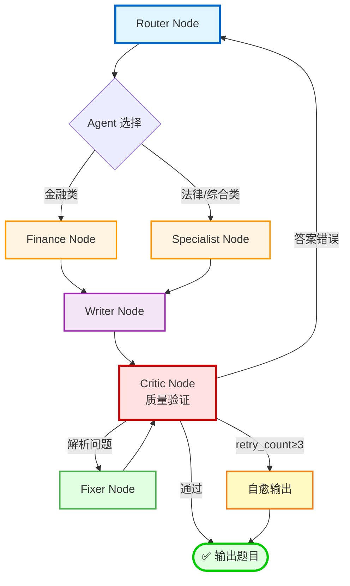
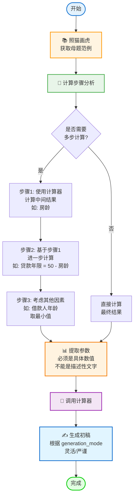
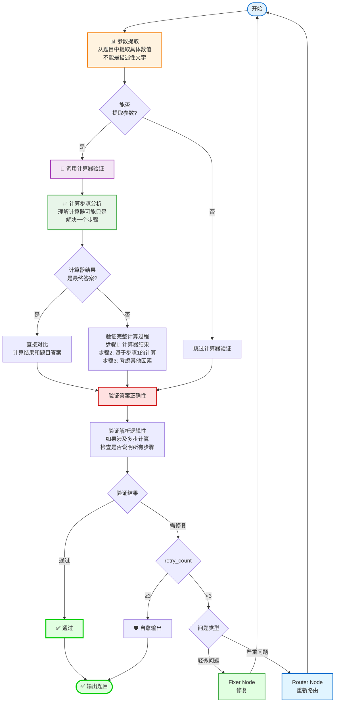
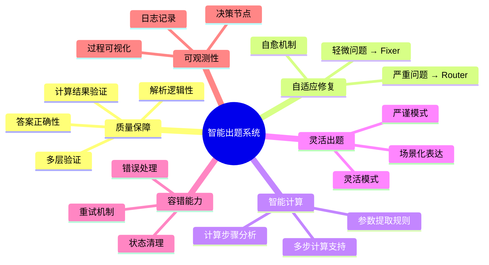

# 智能出题系统 - 可视化流程图

## 完整系统流程图

## 详细流程说明图

## 循环机制详解图

## Finance Node 计算流程详解

## Critic Node 验证流程详解

## 核心功能特性图

## 节点功能说明

| 节点 | 功能 | 关键特性 |
|------|------|----------|
| **Router Node** | 路由决策 | 分析知识点、计算相关度、提取掌握程度 |
| **Finance Node** | 金融题生成 | 照猫画虎、计算步骤分析、参数提取、调用计算器 |
| **Specialist Node** | 法律/综合题生成 | 照猫画虎、生成初稿 |
| **Writer Node** | 格式化 | 标准化 JSON 输出 |
| **Critic Node** | 质量验证 | 参数提取、计算步骤验证、答案验证、解析验证 |
| **Fixer Node** | 错误修复 | 本地修复、循环回到 Critic |
| **自愈机制** | 容错保护 | retry_count≥3 时自动输出 |

## 系统优势

1. 🎯 **质量保障**: 多层验证确保题目准确性
2. 🔄 **自适应修复**: 根据问题严重程度选择修复策略
3. 🛡️ **容错能力**: 完善的错误处理和重试机制
4. 📊 **可观测性**: 完整的日志记录每个决策节点
5. 🧮 **智能计算**: 理解计算步骤，支持多步计算验证
6. 🎨 **灵活出题**: 支持灵活/严谨两种模式，适应不同场景
7. 🎯 **精准参数**: 严格的参数提取规则，确保计算准确性

