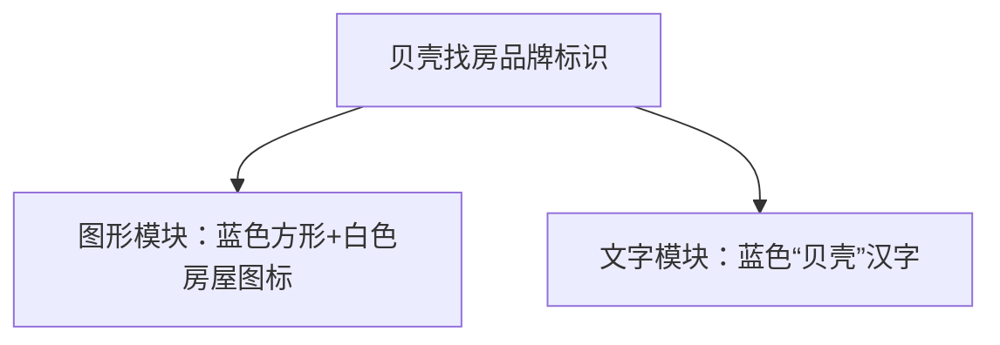
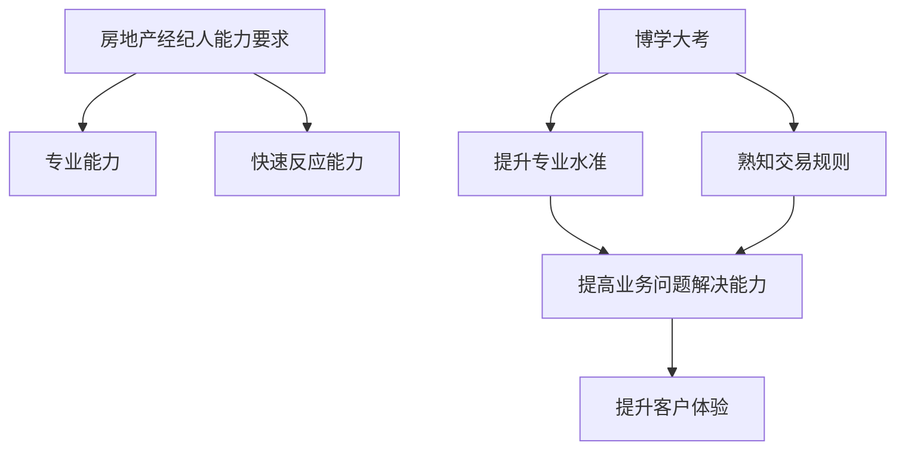
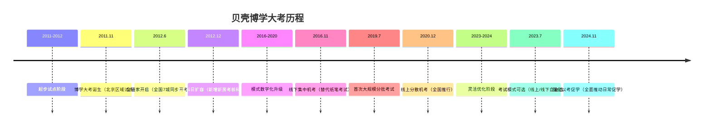
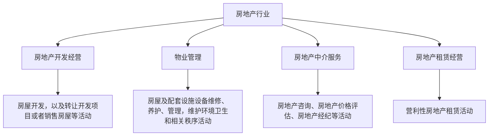

# 图片提示词测试报告（5张）

- 数据文件: `tmp/image_prompt_test_20260228_110907.jsonl`
- 总数: 5
- 成功: 5
- 失败: 0

---

## 第 1 张

- 图片: `/Users/panting/Desktop/搏学考试/AI出题/data/wh/slices/images/v20260224_131517/image1.png`
- 状态: 成功

### 模型输出

### 图片唯一标识
图1

### 图片类型
通用品牌标识（房产服务平台专属）

### 核心主题/标题
贝壳找房官方品牌视觉标识

---

### 一、结构化核心信息（Markdown）

#### 2. 核心业务/权属字段（通用品牌类）
- 品牌主体：贝壳找房
- 视觉构成：
  - 图形元素：蓝色方形底色内嵌白色房屋轮廓图标
  - 文字元素：蓝色“贝壳”汉字标识

---

### 二、可视化图表（Mermaid）


---

### 三、关键关系/核心结论
- 贝壳找房作为房产服务领域的头部平台品牌，为新房交易、二手房交易、家装服务等全房产业务链路提供品牌赋能与平台支撑，构建房产服务业务闭环。

---

### 四、补充说明
- 该标识为贝壳找房官方统一品牌视觉符号，广泛应用于平台入口、业务物料、线下门店等全场景的品牌露出，强化品牌辨识度；贝壳平台覆盖房产交易全流程，具备房源管控、交易服务、流量获客等核心业务能力。

---

## 第 2 张

- 图片: `/Users/panting/Desktop/搏学考试/AI出题/data/wh/slices/images/v20260224_131517/image2.png`
- 状态: 成功

### 模型输出

### 图片唯一标识
图1

### 图片类型
存量房买卖搏学大考辅导教材（业务培训物料）

### 核心主题/标题
第26届贝壳找房武汉区域存量房买卖搏学大考辅导教材封面

---

### 一、结构化核心信息（Markdown）

#### 1. 基础标识信息（证件/表单/签约专属）
- 编号/证书号：第26届
- 发文/签发机关：贝壳找房
- 签署/签发日期：2025年10月
- 唯一标识：武汉区域、存量房买卖科目

#### 2. 核心业务/权属字段（按图片内容分类）

##### （4）营销/业务功能信息
- 核心概念：搏学大考（贝壳全国新经纪品牌专业能力考核体系）
- 关键数据：第26届
- 功能模块：存量房买卖业务专业知识培训辅导
- 覆盖区域：武汉
- 时间节点：2025年10月
- 核心价值：赋能房产经纪人员提升存量房买卖专业能力，助力通过专业考核

---

### 二、可视化图表（Mermaid）
```mermaid
graph TD
  A[顶层：贝壳品牌<br>slogan：让家更美好] --> B[中层：搏学大考IP<br>定位：第26届全国新经纪品牌专业考核<br>理念：搏学 只为更专业]
  B[中层：搏学大考IP<br>定位：第26届全国新经纪品牌专业考核<br>理念：搏学 只为更专业] --> C[底层：业务培训载体<br>第26届贝壳找房搏学大考辅导教材<br>聚焦：存量房买卖<br>区域/时间：武汉 | 2025年10月]
  C[底层：业务培训载体<br>第26届贝壳找房搏学大考辅导教材<br>聚焦：存量房买卖<br>区域/时间：武汉 | 2025年10月] --> D[成长路径：经纪人员通过教材学习→参与考核→实现专业进阶]
```

---

### 三、关键关系/核心结论
- 搏学大考是贝壳赋能新经纪品牌人员专业成长的核心考核机制，第26届武汉区域存量房买卖辅导教材是配套的前置备考工具，聚焦存量房买卖核心业务板块的知识强化。
- 教材明确锚定武汉区域2025年10月的考核周期，为当地经纪人员提供精准的业务知识备考方向。

---

### 四、补充说明
- 识别模糊/缺失的信息：教材具体内容、考核题型、知识模块划分、通过标准等信息缺失
- 行业备注：贝壳搏学大考是房产经纪行业内标准化的专业考核体系，辅导教材是经纪人员夯实业务基础、提升服务专业度的核心资料；存量房买卖是房产交易市场的核心业务品类，涉及房源核验、签约、过户等多环节专业知识。

---

## 第 3 张

- 图片: `/Users/panting/Desktop/搏学考试/AI出题/data/wh/slices/images/v20260224_131517/image3.png`
- 状态: 成功

### 模型输出

### 图片唯一标识
图1

### 图片类型
博学大考能力提升说明（业务能力赋能类）

### 核心主题/标题
房地产经纪人双维度能力要求及博学大考的价值与目的阐述

---

### 一、结构化核心信息（Markdown）

#### 1. 基础标识信息（证件/表单/签约专属）
- 签署人：左晖
- 编号/证书号：信息缺失
- 发文/签发机关：信息缺失
- 签署/签发日期：信息缺失
- 唯一标识：信息缺失

#### 2. 核心业务/权属字段（按图片内容分类）

##### （4）营销/业务功能信息
- 核心观点：房地产经纪人日常作业需同时具备专业能力与快速反应能力；博学大考是针对经纪人的专业能力提升机制
- 功能模块：博学大考
- 核心价值：提升经纪人专业水准，帮助经纪人熟知交易规则，提高经纪人解决业务问题的能力，最终提升客户体验
- 数据指标：无
- 案例信息：无
- 操作路径：无

---

### 二、可视化图表（Mermaid）


---

### 三、关键关系/核心结论
- 博学大考从专业水准提升、交易规则熟知两个维度赋能经纪人，形成「能力提升-问题解决-客户体验优化」的业务闭环；经纪人能力要求为「专业能力+快速反应能力」的双维度标准
- 核心逻辑为：博学大考→经纪人能力升级→客户体验提升

---

### 四、补充说明
- 识别模糊/缺失的信息：未标注发布日期、发布渠道等信息，上述内容信息缺失
- 行业备注：经纪人专业能力是房产交易服务合规、高效推进的核心基础，博学大考是房产经纪行业内部标准化人才培养的重要手段，有助于统一服务标准，降低交易风险

---

## 第 4 张

- 图片: `/Users/panting/Desktop/搏学考试/AI出题/data/wh/slices/images/v20260224_131517/image4.jpeg`
- 状态: 成功

### 模型输出

### 图片唯一标识
图1

### 图片类型
房产经纪博学大考历程时间线+学习路径指引（业务培训物料）

### 核心主题/标题
贝壳博学大考发展历程及学习入口全指引

---

### 一、结构化核心信息（Markdown）

#### 2. 核心业务/权属字段

##### （9）通用层级/逻辑信息（时间线类）
- 时间节点及核心事件：
  - 2011.11：博学大考诞生，北京链家管理层开启博学之路；全北京链家经纪人开启博学大考之路
  - 2012.6：全链家开启，全国链家7城开考，开启博学全国化进程
  - 2012.12：考试科目扩容，首次增加新房考试科目，存量房、新房、租赁三科并存
  - 2016.11：线下集中机考，结束纸笔考试模式，开启线下集中机考模式
  - 2019.7：分批考试，首次大规模分批考试
  - 2020.12：线上分散机考，首次全国推动线上三位位分散考试模式
  - 2023.7：考试模式可选，线上线下考试模式可自行选择
  - 2024.11：强化以考促学，全面推动日常促学

##### （4）营销/业务功能信息
- 操作路径（学习入口）：
  - 入口1：贝壳经纪学堂APP-练习场（需扫码下载贝经堂APP）
  - 入口2：A+/Link-贝壳博学
  - 入口3：A+/Link-贝经堂-练习场
- 额外指引：了解更多博学视频故事，可关注“贝壳博学”视频号

---

### 二、可视化图表（Mermaid）


```mermaid
flowchart LR
  A[经纪人专业学习需求] --> B[选择学习入口]
  B[选择学习入口] --> B1[入口1: 贝壳经纪学堂APP-练习场<br/>(扫码下载APP)]
  B[选择学习入口] --> B2[入口2: A+/Link-贝壳博学]
  B[选择学习入口] --> B3[入口3: A+/Link-贝经堂-练习场]
  B[选择学习入口] --> C[关注"贝壳博学"视频号<br/>(获取更多培训内容)]
```

---

### 三、关键关系/核心结论
- 博学大考从北京区域试点逐步推进至全国化覆盖，考试模式历经纸笔、线下集中机考、线上分散机考到线上线下可选的迭代，实现了考核场景的数字化、灵活化升级，**赋能**经纪人员专业能力持续提升。
- 学习路径提供多入口选择，覆盖移动端APP、内部系统等不同使用场景，满足经纪人碎片化学习需求，形成「考-学-促」的**业务闭环**。

---

### 四、补充说明
- 博学大考是贝壳针对房产经纪人员打造的专业能力考核体系，通过持续优化考试科目与模式，以考促学，强化经纪人员的专业素养，是房产经纪行业人才培养的核心机制之一。
- 多入口学习路径覆盖经纪人日常工作的不同工具场景，降低学习门槛，提升专业培训的触达率与参与度。

---

## 第 5 张

- 图片: `/Users/panting/Desktop/搏学考试/AI出题/data/wh/slices/images/v20260224_131517/image5.png`
- 状态: 成功

### 模型输出

### 图片唯一标识
图1

### 图片类型
房地产行业分类架构图（行业划分）

### 核心主题/标题
国家统计局《2017国民经济行业分类》中房地产行业细分业态及业务范围官方界定

---

### 一、结构化核心信息（Markdown）

#### 9. 通用层级/逻辑信息（架构/公式/时间线）
- 顶层模块：房地产行业
- 中层模块（核心细分业态）：房地产开发经营、物业管理、房地产中介服务、房地产租赁经营
- 底层业务范围：
  - 房地产开发经营：房屋开发，以及转让开发项目或者销售房屋等活动
  - 物业管理：房屋及配套设施设备维修、养护、管理，维护环境卫生和相关秩序活动
  - 房地产中介服务：房地产咨询、房地产价格评估、房地产经纪等活动
  - 房地产租赁经营：营利性房地产租赁活动

---

### 二、可视化图表（Mermaid）


---

### 三、关键关系/核心结论
- 采用「总-分」层级架构，顶层为房地产行业，下设4个平行的核心细分业态，覆盖房地产全产业链的开发、服务、交易、租赁等核心环节
- 各细分业态的业务边界清晰，为行业资质认定、业务统计、合规管控提供官方标准依据

---

### 四、补充说明
- 信息来源：国家统计局《2017国民经济行业分类》
- 行业备注：房地产中介服务作为连接供需的核心服务业态，包含经纪、评估、咨询三类专业服务场景，是房产交易全流程的关键支撑环节；该分类为国内房地产行业的官方标准划分，适用于全行业的合规备案、业务范畴界定等场景。

---
