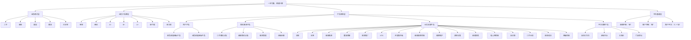
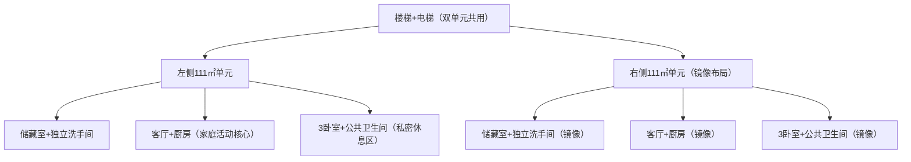
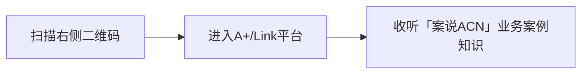
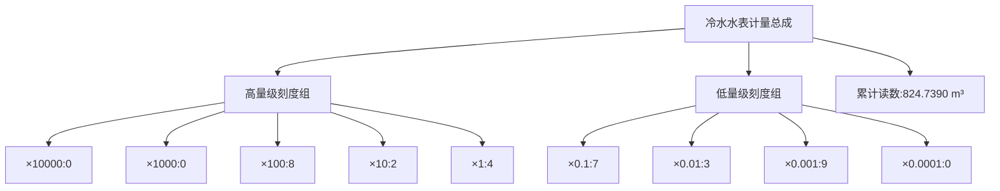

# 图片提示词测试报告（指定8张）

- 数据文件: `tmp/image_prompt_test_20260228_112200.jsonl`
- 总数: 8
- 成功: 8
- 失败: 0

---

## 第 1 张

- 图片: `/Users/panting/Desktop/搏学考试/AI出题/data/wh/slices/images/v20260224_131517/image7.png`
- 状态: 成功

### 模型输出

### 图片唯一标识
图1

### 图片类型
房产平台业务生态架构图（业务支撑/合规管控）

### 核心主题/标题
贝壳房产平台“一体为基，赋能三翼”全链路业务生态架构

---

### 一、结构化核心信息（Markdown）

#### 9. 通用层级/逻辑信息（架构/公式/时间线）
- 顶层模块：一体为基，赋能三翼
- 层级关系：顶层定位-中层业务与产品矩阵-底层平台基建（总-分-支撑）
- 中层模块：
  1. 业务模式层：二手、新房、惠居、整装、贝好家
  2. 业务子品牌层：链家、德佑、A+、B+、U+、新代理、房江湖
  3. 产品矩阵层：
     - 用户产品：[蓝色房屋图标产品、绿色房屋图标产品]
     - 商机客源产品：二手商机分配、新房商机分配、客源管理、企微来客
     - 业务支撑产品：好房、吉签、新房盘源、整装荐客、房源推广、NTS、开发商评级、新房装修荐客、房源维护、资金存管、新房聚焦、省心租荐客、店对盘、二手业财、新房成交、金融荐客
     - 平台运营产品：店东工作台、区域共治、贝壳币、门店积分
- 底层平台基建：楼盘字典：“房”、客户字典：“客”、商户平台：“人”+“店”

---

### 二、可视化图表（Mermaid）


---

### 三、关键关系/核心结论
- 该架构以“一体为基，赋能三翼”为顶层定位，向下覆盖二手、新房、整装等全房产服务场景，通过产品矩阵支撑业务获客、运营、管控全流程，底层平台基建实现“房-客-人-店”的全链路数据支撑，形成完整的业务闭环。
- 各业务子品牌（链家/德佑等）对应不同业务模式，产品模块分别赋能商机分配、客源管理、业务运营等核心环节，实现全场景的业务赋能与管控。
- 平台基建是所有业务的核心支撑，通过“房-客-人-店”的标准化字典，实现全链路数据打通，保障业务的标准化、高效运转。

---

### 四、补充说明
- 该架构是贝壳房产平台的核心业务生态框架，覆盖房产交易、整装、租赁等全品类服务，通过统一的平台基建实现数据协同，为前端业务提供标准化支撑，提升业务运转效率。
- 产品矩阵中的“企微来客”聚焦私域获客，“金融荐客”拓展增值服务边界，进一步强化用户粘性与业务变现能力。
- 业务子品牌层的A+、B+等属于平台加盟/代理品牌，对应不同规模与定位的合作门店，实现平台对不同层级市场的覆盖。

---

## 第 2 张

- 图片: `/Users/panting/Desktop/搏学考试/AI出题/data/wh/slices/images/v20260224_131517/image11.png`
- 状态: 成功

### 模型输出

### 图片唯一标识
图1

### 图片类型
住宅户型平面图（房源核心物料）

### 核心主题/标题
111㎡镜像对称式双单元住宅户型布局图

---

### 一、结构化核心信息（Markdown）

#### 1. 基础标识信息
- 单单元建筑面积：111㎡
- 布局类型：两梯两户（镜像对称双单元）
- 唯一标识：左右单元户型配置完全镜像一致

#### 2. 核心业务/权属字段（房源户型专属）
##### （房源户型信息）
- 单单元空间构成：3室2厅2卫+入户储藏室
- 空间布局（以左侧单元为例，右侧单元镜像复制）：
  - 入户配套区：入户旁设置**储藏室+独立洗手间**，强化入户收纳与便捷盥洗功能
  - 动区（公共活动）：中部集中布局**客厅（含起居家具预留位）+厨房**，形成家庭活动核心区
  - 静区（私密休息）：下部设置3个独立卧室（含衣柜/书桌功能布局位）+公共卫生间，与动区实现物理分隔
- 公共配套：单元中部设置**楼梯+电梯**，为双单元共用垂直交通设施

---

### 二、可视化图表（Mermaid）


---

### 三、关键关系/核心结论
- 该户型采用**镜像对称式**标准化布局，便于建筑规划与后期物业服务管理
- 单单元实现清晰的**动-静分区**，避免起居活动对私密休息区域的干扰，提升居住舒适度
- 入户储藏室+独立洗手间的配置，强化了户型的实用属性，适配刚需/改善型多人口家庭需求

---

### 四、补充说明
- 户型标注的111㎡为单单元建筑面积，未明确标注套内使用面积与公摊面积
- 图中仅展示平面布局，未标注空间开间/进深尺寸、朝向等核心房源参数，信息存在部分缺失

---

## 第 3 张

- 图片: `/Users/panting/Desktop/搏学考试/AI出题/data/wh/slices/images/v20260224_131517/image20.png`
- 状态: 成功

### 模型输出

### 图片唯一标识
图1

### 图片类型
通用业务入口二维码

### 核心主题/标题
未明确标注的房产行业业务入口二维码

---

### 一、结构化核心信息（Markdown）

#### 1. 基础标识信息（通用专属）
- 唯一标识：二维码图形（内部关联内容需扫描读取，当前识别状态：信息缺失）

---

### 二、可视化图表（Mermaid）
```mermaid
graph TD
  A[房产业务入口二维码] --> B[扫码读取内部内容]
  B[扫码读取内部内容] --> C[跳转至对应房产业务场景<br/>(私域获客/业务查询/流程办理等)]
```

---

### 三、关键关系/核心结论
- 该二维码为房产行业线上线下业务联动的入口载体，可通过扫码跳转至对应业务场景，实现私域获客、业务查询、流程办理等房产相关功能，具体场景需扫码验证。

---

### 四、补充说明
- 识别限制：仅能识别二维码的图形形态，无法直接提取其内部关联的房产业务信息，需借助扫码工具读取后，方可进行进一步的结构化分析。
- 行业备注：房产行业中，此类二维码常被用于私域获客物料（如挪车卡、名片、营销海报）、业务流程入口（如签约进度查询、房源详情查看）等场景，是打通线上流量与线下业务的核心触点。

---

## 第 4 张

- 图片: `/Users/panting/Desktop/搏学考试/AI出题/data/wh/slices/images/v20260224_131517/image23.png`
- 状态: 成功

### 模型输出

### 图片唯一标识
图1

### 图片类型
房贷还款构成图（金融数据可视化）

### 核心主题/标题
房贷还款周期内本金与利息占比动态变化趋势图

---

### 一、结构化核心信息（Markdown）

#### 1. 基础标识信息（证件/表单/签约专属）
- 编号/证书号：信息缺失
- 发文/签发机关：信息缺失
- 签署/签发日期：信息缺失
- 唯一标识：信息缺失

#### 2. 核心业务/权属字段（按图片内容分类）

##### （7）金融图表（房贷还款专属）
- 图表类型：等额本息还款
- 本金/利息变化：单期还款额中，本金占比随还款期数推进逐月递增，利息占比逐月递减；还款初期利息为单期还款的核心构成部分，还款末期本金占比远超利息占比。

---

### 二、可视化图表（Mermaid）
```mermaid
line
    title 房贷还款本金利息占比趋势
    x-axis 还款期数（第1期 → 最后1期）
    y-axis 单期还款占比（%）
  本金: 10 --> 90
  利息: 90 --> 10
```

---

### 三、关键关系/核心结论
- 该图表呈现了等额本息还款方式下本金与利息的反向动态占比关系：还款前期以利息偿还为核心，随着还款流程推进，本金偿还占比持续提升，利息占比逐步降低，最终完成全部本息的偿还闭环。

---

### 四、补充说明
- 识别模糊/缺失的信息：无明确还款总期数、单期还款额、贷款总金额等具体数据，信息缺失。
- 行业备注：等额本息是房贷两大主流还款方式之一，每月还款金额固定，总利息支出高于等额本金还款方式，适配收入稳定、追求还款压力均衡的借款人；等额本金还款方式每月本金固定、利息逐月递减，前期还款压力较大，总利息支出更低，适配收入较高、能承担前期压力的借款人。

---

## 第 5 张

- 图片: `/Users/panting/Desktop/搏学考试/AI出题/data/wh/slices/images/v20260224_131517/image28.png`
- 状态: 成功

### 模型输出

### 图片唯一标识
图1

### 图片类型
案说ACN业务知识传播物料（图文物料）

### 核心主题/标题
A+/Link扫码收听「案说ACN」房产经纪业务案例知识

---

### 一、结构化核心信息（Markdown）

#### 1. 基础标识信息（证件/表单/签约专属）
- 唯一标识：二维码（内容未解析，标注“信息缺失”）

#### 2. 核心业务/权属字段（按图片内容分类）
##### （4）营销/业务功能信息
- 核心观点：以轻量化扫码方式，触达房产从业者传播ACN业务案例知识
- 功能模块：二维码入口、A+/Link音频收听渠道
- 操作路径：扫描图片右侧二维码 → 进入A+/Link平台 → 收听「案说ACN」相关内容

---

### 二、可视化图表（Mermaid）


---

### 三、关键关系/核心结论
- 该物料以二维码为前置入口，赋能房产从业者便捷获取ACN业务案例知识，搭建轻量化的业务学习路径，降低业务知识获取的门槛。

---

### 四、补充说明
- 识别模糊/缺失的信息：二维码具体跳转内容未解析，标注“信息缺失”
- 行业备注：ACN（Agent Cooperation Network）是房产经纪行业的合作网络体系，通过案例讲解可帮助从业者深化对ACN规则、合作逻辑的理解，提升业务协作效率；扫码收听的形式适配移动化学习场景，契合房产从业者碎片化学习的需求。

---

## 第 6 张

- 图片: `/Users/panting/Desktop/搏学考试/AI出题/data/wh/slices/images/v20260224_131517/image26.png`
- 状态: 成功

### 模型输出

### 图片唯一标识
图1

### 图片类型
新房聚焦盘查找指引（业务操作图文物料）

### 核心主题/标题
5类新房聚焦盘的查找入口及对应操作页面展示

---

### 一、结构化核心信息（Markdown）

#### 1. 基础标识信息（证件/表单/签约专属）
- 编号/证书号：信息缺失
- 发文/签发机关：信息缺失
- 签署/签发日期：活动周期标注为2024.07.23-2024.08.06
- 唯一标识：信息缺失

#### 2. 核心业务/权属字段（按图片内容分类）

##### （4）营销/业务功能信息
- 核心概念：新房聚焦盘（平台重点推广的新房项目，配套专属标识与权益）
- 关键数据：
  - 活动周期：2024.07.23-2024.08.06
  - 聚焦盘示例价格：保利时代 14000元/㎡
- 功能价值：全场景覆盖经纪人作业路径，降低找盘成本，赋能经纪人精准对接重点新房项目，联动获客场景提升推盘转化效率
- 操作路径（5类查找入口）：
  1. 【房客工具-新房聚焦专区】：从“全部应用-房客工具”模块，点击“新房聚焦”图标进入，专区内含活动权益及聚焦盘列表
  2. 【房源列表聚焦标签】：房源列表页内，带有红色“聚”标签的项目即为新房聚焦盘
  3. 【房源列表置顶】：房源列表顶部标注“应用主推”的置顶项目为新房聚焦盘
  4. 【码上有客聚焦专区】：进入“码上有客”页面，在“新房聚焦”板块查看对应聚焦盘项目
  5. 【IM-新房推荐官】：通过IM端口的“新房推荐官”模块，获取平台推送的聚焦盘活动及项目信息

---

### 二、可视化图表（Mermaid）
```mermaid
flowchart LR
  A[经纪人作业场景] --> B[房客工具-新房聚焦专区]
  A[经纪人作业场景] --> C[房源列表聚焦标签]
  A[经纪人作业场景] --> D[房源列表置顶]
  A[经纪人作业场景] --> E[码上有客聚焦专区]
  A[经纪人作业场景] --> F[IM-新房推荐官]
  B[房客工具-新房聚焦专区] --> B1[查看聚焦盘+专属活动权益]
  C[房源列表聚焦标签] --> C1[识别红色"聚"标签项目]
  D[房源列表置顶] --> D1[查看顶部"应用主推"项目]
  E[码上有客聚焦专区] --> E1[进入"新房聚焦"板块查看]
  F[IM-新房推荐官] --> F1[接收聚焦盘活动/项目推送]
```

---

### 三、关键关系/核心结论
- 平台通过**全场景覆盖**（作业工具、房源列表、私域获客、IM推送）布局新房聚焦盘入口，构建经纪人“找盘-推盘-获客”的业务闭环，赋能经纪人高效对接重点新房资源
- 新房聚焦盘带有专属识别标识（红色"聚"标签、置顶标注），部分项目配套专属推广权益，提升经纪人推荐动力与转化效率

---

### 四、补充说明
- 识别模糊/缺失的信息：平台官方名称未明确展示，聚焦盘的专属权益细则（除活动时间外）未完全披露
- 行业备注：新房聚焦盘通常为平台与开发商深度合作的重点项目，经纪人推荐此类项目可获得更高业绩分成、流量扶持等专属权益，是新房业务获客转化的核心资源池

---

## 第 7 张

- 图片: `/Users/panting/Desktop/搏学考试/AI出题/data/wh/slices/images/v20260224_131517/image24.png`
- 状态: 成功

### 模型输出

### 图片唯一标识
图1

### 图片类型
通用计量器具（冷水水表，关联房产物业服务场景）

### 核心主题/标题
东北牌N2.5H旋翼式冷水水表计量表盘及参数信息

---

### 一、结构化核心信息（Markdown）

#### 1. 基础标识信息（通用计量专属）
- 编号/证书号：京制00000139号；表盘底部唯一编号：0822469
- 发文/签发机关：北京市计量监管部门（依据“京制”标识推断）
- 签署/签发日期：信息缺失
- 唯一标识：0822469；京制00000139号

#### 2. 核心业务/权属字段（关联房产物业服务）
##### （9）通用层级/逻辑信息（架构/公式/时间线）
- 顶层模块：冷水水表计量总成
- 核心逻辑：累计用水量=Σ（各刻度盘数值×对应量级）
- 计量层级（高到低量级）：×10000 → ×1000 → ×100 → ×10 → ×1 → ×0.1 → ×0.01 → ×0.001 → ×0.0001
- 数值/参数：
  - 水表型号：N2.5H
  - 压力要求：Δ<0.1MPa
  - 计量单位：m³（立方米）
  - 当前各刻度盘读数：
    | 量级 | 对应读数 |
    | :--- | :--- |
    | ×10000 | 0 |
    | ×1000 | 0 |
    | ×100 | 8 |
    | ×10 | 2 |
    | ×1 | 4 |
    | ×0.1 | 7 |
    | ×0.01 | 3 |
    | ×0.001 | 9 |
    | ×0.0001 | 0 |
  - 累计用水量：824.7390 m³

---

### 二、可视化图表（Mermaid）


---

### 三、关键关系/核心结论
- 该水表为东北牌旋翼式冷水水表，按**高量级-低量级**层级划分刻度盘，通过各刻度盘读数×对应量级累加计算累计用水量；
- 水表适用压力小于0.1MPa，属于小口径家用冷水计量器具，在房产租赁、物业服务场景中是水费核算、用水管控的核心工具，当前累计用水量为824.7390立方米。

---

### 四、补充说明
- 识别模糊/缺失的信息：水表签发日期信息缺失；
- 行业备注：在房产服务场景中，水表读数是物业与业主/租户核算水费的核心依据，需按量级从高到低精准统计，避免读数误差引发纠纷。

---

## 第 8 张

- 图片: `/Users/panting/Desktop/搏学考试/AI出题/data/wh/slices/images/v20260224_131517/image32.jpeg`
- 状态: 成功

### 模型输出

### 图片唯一标识
图1

### 图片类型
贝壳“博仕巅·荣耀之旅”主题团建活动物料（图文物料）

### 核心主题/标题
贝壳内部员工参与古风主题沉浸式互动团建活动

---

### 一、结构化核心信息（Markdown）

#### 2. 核心业务/权属字段（业务/营销类）
- 主办主体：贝壳
- 活动主题：博仕巅·荣耀之旅
- 活动形式：古风主题沉浸式互动团建（参与者身着古装，开展桌牌类互动游戏）
- 参与对象：贝壳内部员工
- 场景特征：中式古风场景布置（木质榫卯结构空间、传统古装服饰）

---

### 二、可视化图表（Mermaid）
无（图片为活动实拍场景，无流程、架构、公式等可可视化的逻辑关系）

---

### 三、关键关系/核心结论
- 贝壳通过古风沉浸式团建活动，强化内部团队凝聚力与员工文化认同，赋能后续房产交易服务的团队协作效率提升。

---

### 四、补充说明
- 该活动属于房产服务平台内部团队文化建设范畴，以场景化互动形式增强员工归属感，为前端房产经纪获客、交易办理等业务的团队协作提供文化支撑。
- 活动主题“博仕巅·荣耀之旅”传递对优秀员工的表彰属性，兼具团队激励与文化建设双重作用。

---
